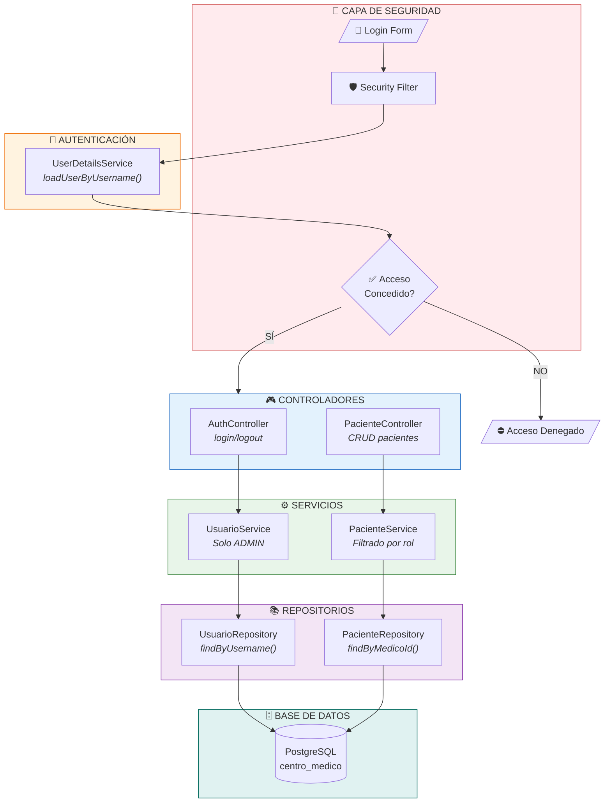

# ACTIVIDAD EVALUABLE - RA3
## Sistema de Gestión de Centro Médico con Spring Boot, JPA y Spring Security

---

**Módulo:** Acceso a Datos
**Resultado de Aprendizaje:** RA3 - Gestiona la persistencia de los datos identificando herramientas de mapeo objeto relacional (ORM)
**Duración:** 120 minutos (2 horas)
**Modalidad:** Individual - Presencial en aula

---

## NORMAS DE LA PRUEBA

> **IMPORTANTE: LEE ATENTAMENTE ANTES DE COMENZAR**

### Tiempo y Entrega
- **Tiempo máximo:** 120 minutos desde el inicio de la prueba
- **Entrega:** Al finalizar el tiempo, la prueba debe estar **entregada y funcionando**
- Si la aplicación no está entregada o no funciona al acabar el tiempo, se considerará **NO APTO** aunque esté "casi terminada"

### Recursos Permitidos
| Permitido | No Permitido |
|:---------:|:------------:|
| IntelliJ IDEA | Internet / Navegador web |
| Proyecto propio desarrollado previamente | Documentos externos (Word, PDF, TXT) |
| PostgreSQL local | Copiar código de compañeros |
| Terminal / Consola | ChatGPT, Copilot u otras IA |

### Condiciones de Evaluación

⚠️ **REQUISITO OBLIGATORIO PARA APROBAR:**

Para superar esta actividad evaluable es **OBLIGATORIO** completar los **4 primeros bloques** de la rúbrica:

| Bloque | Contenido | Obligatorio |
|:------:|-----------|:-----------:|
| 1 | Base de Datos y Configuración | ✓ SÍ |
| 2 | Entidades JPA con Relación | ✓ SÍ |
| 3 | Repositorios | ✓ SÍ |
| 4 | Spring Security | ✓ SÍ |
| 5 | Servicios CRUD | Opcional* |
| 6 | Controladores y Demostración | Opcional* |

*Los bloques 5 y 6 suman puntos adicionales, pero sin los 4 primeros la nota máxima será **4.0 (SUSPENSO)**.

---

## CONTEXTO

Un centro médico necesita implementar un sistema de gestión de pacientes con control de acceso basado en roles. El sistema debe permitir que los médicos gestionen únicamente sus propios pacientes, mientras que el personal de recepción solo puede consultar información y los administradores tienen acceso completo.

Se te ha encargado desarrollar el módulo de gestión que incluya autenticación segura y autorización por roles.

---

## REQUISITOS TÉCNICOS

### Base de Datos
- **SGBD:** PostgreSQL (obligatorio)
- **Nombre de la base de datos:** `centro_medico`

### Tabla `usuarios`
```sql
CREATE TYPE rol_usuario AS ENUM ('ADMIN', 'MEDICO', 'RECEPCION');

CREATE TABLE usuarios (
    id BIGSERIAL PRIMARY KEY,
    username VARCHAR(50) NOT NULL UNIQUE,
    email VARCHAR(100) NOT NULL UNIQUE,
    password_hash VARCHAR(255) NOT NULL,
    nombre VARCHAR(100) NOT NULL,
    rol rol_usuario NOT NULL,
    activo BOOLEAN DEFAULT TRUE,
    fecha_creacion TIMESTAMP DEFAULT CURRENT_TIMESTAMP
);
```

### Tabla `pacientes`
```sql
CREATE TABLE pacientes (
    id BIGSERIAL PRIMARY KEY,
    nombre VARCHAR(100) NOT NULL,
    apellidos VARCHAR(100) NOT NULL,
    dni VARCHAR(15) NOT NULL UNIQUE,
    telefono VARCHAR(20),
    fecha_nacimiento DATE,
    historial TEXT,
    medico_id BIGINT REFERENCES usuarios(id),
    activo BOOLEAN DEFAULT TRUE,
    fecha_creacion TIMESTAMP DEFAULT CURRENT_TIMESTAMP
);
```

### Tecnologías a utilizar
- **Spring Boot** (versión 3.x)
- **Spring Data JPA**
- **Hibernate** (como implementación JPA)
- **Spring Security** para autenticación y autorización
- **BCrypt** para el hash de contraseñas
- **Thymeleaf** o **API REST** (a elección del alumno)
- **Lombok** (opcional, pero recomendado)

---

## MATRIZ DE PERMISOS POR ROL

| Acción | ADMIN | MEDICO | RECEPCION |
|--------|:-----:|:------:|:---------:|
| Login/Logout | ✓ | ✓ | ✓ |
| Ver todos los pacientes | ✓ | ✗ | ✓ |
| Ver solo sus pacientes | ✓ | ✓ | ✗ |
| Crear paciente | ✓ | ✓ | ✗ |
| Editar paciente | ✓ | ✓ (solo suyos) | ✗ |
| Eliminar paciente | ✓ | ✗ | ✗ |
| Gestionar usuarios | ✓ | ✗ | ✗ |

---

## TAREAS A REALIZAR

### PARTE 1: Configuración del Proyecto y Base de Datos (OBLIGATORIO)

#### 1.1 Crear la base de datos
- Crear la base de datos `centro_medico`
- Crear las tablas `usuarios` y `pacientes` con la estructura indicada
- Insertar datos de prueba:
  - 1 usuario ADMIN
  - 2 usuarios MEDICO
  - 1 usuario RECEPCION
  - Al menos 4 pacientes (2 asignados a cada médico)

#### 1.2 Configurar el proyecto Spring Boot
- Crear proyecto con las dependencias necesarias:
  - Spring Data JPA
  - Spring Security
  - Spring Web
  - Thymeleaf (opcional si se usa API REST)
  - Driver de base de datos correspondiente
  - Lombok (opcional)

#### 1.3 Configurar `application.properties`
- Configurar la conexión a la base de datos
- Configurar las propiedades de Hibernate/JPA
- Configurar propiedades de seguridad si es necesario

---

### PARTE 2: Entidades JPA con Relación (OBLIGATORIO)

#### 2.1 Crear la entidad `Usuario`
- Mapear correctamente todos los campos de la tabla
- Usar ENUM para el campo `rol`
- Implementar método para verificar contraseña con BCrypt
- Configurar la relación `@OneToMany` con Paciente

#### 2.2 Crear la entidad `Paciente`
- Mapear correctamente todos los campos de la tabla
- Configurar la relación `@ManyToOne` con Usuario (médico asignado)
- Usar `@JoinColumn` para la clave foránea

---

### PARTE 3: Repositorios (OBLIGATORIO)

#### 3.1 Crear `UsuarioRepository`
- Extender de `JpaRepository`
- Implementar método `findByUsername` (necesario para Spring Security)
- Implementar método `findByRol`

#### 3.2 Crear `PacienteRepository`
- Extender de `JpaRepository`
- Implementar método `findByMedicoId` (pacientes de un médico)
- Implementar método `findByDni`
- Implementar método `findByActivoTrue`

---

### PARTE 4: Configuración de Seguridad (OBLIGATORIO)

#### 4.1 Implementar `UserDetailsService`
- Crear clase `CustomUserDetailsService`
- Cargar usuario desde base de datos
- Convertir rol a `GrantedAuthority`

#### 4.2 Configurar `SecurityConfig`
- Configurar `SecurityFilterChain`
- Definir rutas públicas y protegidas
- Configurar formulario de login
- Configurar logout
- Aplicar restricciones por rol según la matriz de permisos

---

### PARTE 5: Servicios CRUD (OBLIGATORIO)

#### 5.1 Crear `UsuarioService`
| Operación | Método | Restricción |
|-----------|--------|-------------|
| CREATE | `crearUsuario(...)` | Solo ADMIN |
| READ | `obtenerTodos()` | Solo ADMIN |
| READ | `obtenerPorUsername(String)` | Autenticado |
| UPDATE | `actualizarUsuario(...)` | Solo ADMIN |
| DELETE | `eliminarUsuario(Long)` | Solo ADMIN |

#### 5.2 Crear `PacienteService`
| Operación | Método | Restricción |
|-----------|--------|-------------|
| CREATE | `crearPaciente(...)` | ADMIN, MEDICO |
| READ | `obtenerTodos()` | ADMIN, RECEPCION |
| READ | `obtenerPorMedico(Long)` | ADMIN, MEDICO (el suyo) |
| READ | `obtenerPorId(Long)` | Según rol |
| UPDATE | `actualizarPaciente(...)` | ADMIN, MEDICO (solo suyos) |
| DELETE | `eliminarPaciente(Long)` | Solo ADMIN |

---

### PARTE 6: Controladores (OBLIGATORIO)

#### 6.1 Controlador de Autenticación
- Página de login personalizada
- Gestión de logout
- Redirección según rol tras login

#### 6.2 Controlador de Pacientes
- Implementar endpoints/vistas para CRUD
- Aplicar restricciones de acceso por rol
- Filtrar pacientes según el usuario logueado (si es MEDICO)

---

### PARTE 7: Demostración Funcional (OBLIGATORIO)

Demostrar el funcionamiento del sistema:

1. **Login** como ADMIN → Acceso total
2. **Login** como MEDICO → Solo ve sus pacientes
3. **Login** como RECEPCION → Solo lectura de todos los pacientes
4. Intentar acceso no autorizado → Debe denegar

---

## ENTREGABLES

1. **Script SQL** de creación de la base de datos, tablas y datos de prueba
2. **Proyecto Spring Boot** completo con:
   - Entidades con relación `@ManyToOne` / `@OneToMany`
   - Repositorios con Query Methods
   - Configuración de Spring Security
   - Servicios con lógica de negocio
   - Controladores (Web o REST)
3. **Capturas de pantalla** mostrando:
   - Login exitoso con cada rol
   - Restricción de acceso funcionando
   - CRUD de pacientes

---

## CRITERIOS DE EVALUACIÓN ASOCIADOS

| Código | Criterio | Relación con la actividad |
|--------|----------|---------------------------|
| 3a | Instalación herramienta ORM | Configuración del proyecto Spring Boot con JPA |
| 3b | Configuración herramienta ORM | application.properties con conexión a BBDD |
| 3c | Ficheros de mapeo | Entidades con anotaciones JPA y relaciones |
| 3d | Aplicación del mapeo | Operaciones CRUD funcionando con FK |
| 3e | Consultas SQL ORM | Query Methods con filtros y joins |
| 3f | Gestión de transacciones | Operaciones de servicio transaccionales |

---

\newpage

# RÚBRICA DE EVALUACIÓN

## CONDICIÓN OBLIGATORIA PARA SUPERAR LA PRUEBA

> ⚠️ **MUY IMPORTANTE:** Para aprobar esta actividad evaluable es **OBLIGATORIO** superar los **4 primeros bloques** de la rúbrica. Si alguno de estos bloques no está completado o no funciona, la nota máxima será **4.0 (NO APTO)**.

| Bloque Obligatorio | Contenido | Puntos |
|--------------------|-----------|:------:|
| BLOQUE 1 | Base de Datos y Configuración | 2.0 |
| BLOQUE 2 | Entidades JPA con Relación | 2.0 |
| BLOQUE 3 | Repositorios | 1.0 |
| BLOQUE 4 | Spring Security | 2.5 |
| **TOTAL OBLIGATORIO** | **Mínimo para aprobar** | **7.5** |

---

## REQUISITOS MÍNIMOS PARA APROBAR (5.0)

| Requisito Mínimo | Cumple | No Cumple |
|------------------|:------:|:---------:|
| Base de datos creada con ambas tablas | ✓ | ✗ → **NO APTO** |
| Relación FK entre pacientes y usuarios | ✓ | ✗ → **NO APTO** |
| Proyecto Spring Boot arranca sin errores | ✓ | ✗ → **NO APTO** |
| Login funciona con Spring Security | ✓ | ✗ → **NO APTO** |
| Entidades mapeadas con @ManyToOne | ✓ | ✗ → **NO APTO** |
| Aplicación entregada dentro del tiempo | ✓ | ✗ → **NO APTO** |
| Aplicación funciona correctamente | ✓ | ✗ → **NO APTO** |

---

## PUNTUACIÓN DETALLADA

### BLOQUE 1: Base de Datos y Configuración (2 puntos) - ⚠️ OBLIGATORIO

| Elemento | Puntos | Criterio |
|----------|:------:|----------|
| Base de datos creada | 0.25 | Existe la BBDD `centro_medico` |
| Tabla usuarios correcta | 0.25 | Campos y ENUM de roles |
| Tabla pacientes con FK | 0.25 | Relación con usuarios (medico_id) |
| Datos de prueba | 0.25 | Usuarios de cada rol + pacientes |
| application.properties | 0.5 | Conexión y propiedades Hibernate |
| Proyecto arranca | 0.5 | Sin errores de configuración |

**Si este bloque no está completo: SUSPENSO (máximo 4.0)**

---

### BLOQUE 2: Entidades JPA con Relación (2 puntos) - ⚠️ OBLIGATORIO

| Elemento | Puntos | Criterio |
|----------|:------:|----------|
| Entidad Usuario con anotaciones | 0.25 | @Entity, @Table, @Id, @Column |
| ENUM para rol | 0.25 | @Enumerated correctamente |
| Entidad Paciente con anotaciones | 0.25 | @Entity, @Table, @Id, @Column |
| Relación @ManyToOne | 0.5 | Paciente → Usuario (médico) |
| Relación @OneToMany | 0.25 | Usuario → List<Paciente> |
| @JoinColumn configurado | 0.25 | FK con nombre correcto |
| FetchType apropiado | 0.25 | LAZY o EAGER según corresponda |

---

### BLOQUE 3: Repositorios (1 punto) - ⚠️ OBLIGATORIO

| Elemento | Puntos | Criterio |
|----------|:------:|----------|
| UsuarioRepository extiende JpaRepository | 0.25 | Correcta definición |
| findByUsername | 0.25 | Para Spring Security |
| PacienteRepository | 0.25 | Correcta definición |
| findByMedicoId | 0.25 | Filtrar por médico asignado |

---

### BLOQUE 4: Spring Security (2.5 puntos) - ⚠️ OBLIGATORIO

| Elemento | Puntos | Criterio |
|----------|:------:|----------|
| CustomUserDetailsService | 0.5 | Carga usuarios de BBDD |
| SecurityConfig básico | 0.5 | SecurityFilterChain configurado |
| Rutas protegidas por rol | 0.5 | hasRole() aplicado correctamente |
| Formulario login funciona | 0.5 | Login y redirección |
| Logout funciona | 0.25 | Cierra sesión correctamente |
| Acceso denegado gestionado | 0.25 | Página o mensaje de error 403 |

---

### BLOQUE 5: Servicios CRUD (1.5 puntos) - OPCIONAL (suma nota)

| Elemento | Puntos | Criterio |
|----------|:------:|----------|
| CRUD Usuario básico | 0.25 | Create, Read, Update, Delete |
| CRUD Paciente básico | 0.25 | Create, Read, Update, Delete |
| Filtrar pacientes por médico | 0.5 | MEDICO solo ve sus pacientes |
| Validación de permisos | 0.25 | Verifica rol antes de operar |
| @Transactional | 0.25 | En métodos de escritura |

---

### BLOQUE 6: Controladores y Demostración (1 punto) - OPCIONAL (suma nota)

| Elemento | Puntos | Criterio |
|----------|:------:|----------|
| Controlador de autenticación | 0.25 | Login/logout personalizados |
| Controlador de pacientes | 0.25 | CRUD accesible |
| Demostración ADMIN | 0.15 | Acceso total |
| Demostración MEDICO | 0.15 | Solo sus pacientes |
| Demostración RECEPCION | 0.10 | Solo lectura |
| Intento acceso denegado | 0.10 | Se bloquea correctamente |

---

## TABLA RESUMEN DE CALIFICACIÓN

| Bloque | Tipo | Puntos Máx. | Puntos Obtenidos |
|--------|:----:|:-----------:|:----------------:|
| 1. Base de Datos y Configuración | ⚠️ OBLIG. | 2.0 | |
| 2. Entidades JPA con Relación | ⚠️ OBLIG. | 2.0 | |
| 3. Repositorios | ⚠️ OBLIG. | 1.0 | |
| 4. Spring Security | ⚠️ OBLIG. | 2.5 | |
| **SUBTOTAL OBLIGATORIO** | | **7.5** | |
| 5. Servicios CRUD | Opcional | 1.5 | |
| 6. Controladores y Demostración | Opcional | 1.0 | |
| **TOTAL** | | **10.0** | |

> **Nota:** Si el subtotal obligatorio no está completo → **NO APTO (máx. 4.0)**

---

## ESCALA DE NOTAS

| Nota | Descripción |
|------|-------------|
| 10 | Excelente - Sistema completo con seguridad perfecta |
| 9 | Sobresaliente - Todo funciona, mínimos detalles |
| 8 | Notable alto - Seguridad y CRUD completos |
| 7 | Notable - 4 bloques obligatorios + parte de opcionales |
| 6 | Bien - 4 bloques obligatorios completos |
| 5 | Suficiente - 4 bloques obligatorios con mínimos errores |
| 0-4 | **NO APTO** - No cumple los 4 bloques obligatorios o no entregado a tiempo |

---

## OBSERVACIONES DEL PROFESOR

| Aspecto | Comentario |
|---------|------------|
| Puntos fuertes | |
| Áreas de mejora | |
| Comentarios adicionales | |

---

**Firma del alumno:** _________________________ **Fecha:** _____________

**Firma del profesor:** _________________________ **Nota Final:** _____________

---

## ANEXO: Diagrama de Arquitectura


